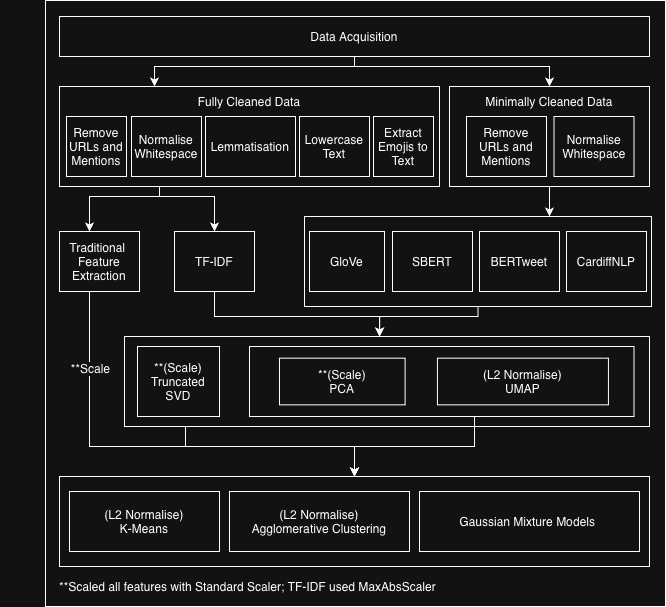

# Airline Twitter Sentiment Clustering

This project explores **unsupervised sentiment clustering** on airline passengers’ tweets about their flight experiences.  
The goal is to discover how well different text representation and clustering techniques can automatically group tweets into sentiment categories such as **positive**, **neutral**, and **negative**.


## References

1. Ma, Yuan, and Wu (2017). *Exploring Performance of Clustering Methods on Document Sentiment Analysis.*
   - Limitation: Their preprocessing removed stopwords and applied stemming, which reduced the preservation of key sentiment cues like adjectives and adverbs.
     They also noted that K-Means tends to perform poorly on imbalanced datasets common in sentiment data.
   - Our Adaptation: We minimized stopword removal to retain adjectives/adverbs crucial for emotional tone,
     and incorporated Gaussian Mixture Models (GMM) and Agglomerative Clustering to better handle data imbalance.

2. Salloum et al. (2024). *K-Means Clustering of Tweet Emotions: A 2D PCA Visualization Approach.*
   - Limitation: While TF-IDF + PCA + K-Means allowed for efficient visualization, it struggled with overlapping emotions 
     and lacked deep semantic understanding due to reliance on surface-level features.
   - Our Adaptation: We extend their framework by replacing TF-IDF with contextual embeddings (BERTweet, CardiffNLP) 
     and applying dimensionality reduction (PCA/UMAP) for clearer, semantically coherent visualization and clustering.

Summary of Our Approach:
Building on both studies, our model combines contextualized embeddings with multiple clustering techniques 
to overcome issues of feature sparsity, semantic overlap, and class imbalance. This produces clusters that are 
more interpretable, sentiment-aware, and reflective of real-world tweet distributions.


## Overview

This project applies various **language models** and **clustering algorithms** to perform sentiment grouping on social media data.




### Objectives

- Clean and preprocess raw Twitter text data  
- Transform tweets into feature vectors using various representation methods:
  - **Traditional feature extraction** – handcrafted statistical features such as word count, average word length, punctuation frequency, uppercase ratio, and emoji usage.  
    *(No dimensionality reduction applied.)*
  - **TF-IDF** – converts text into sparse vector representations of term importance.  
    - **Dimensionality reduction:** *Truncated SVD*, *PCA*, or *UMAP*
  - **GloVe** – pre-trained Twitter word embeddings averaged at sentence level.  
    - **Dimensionality reduction:** *PCA* or *UMAP*
  - **SBERT** – Sentence-BERT sentence embeddings representing semantic meaning.  
    - **Dimensionality reduction:** *PCA* or *UMAP*
  - **BERTweet** – transformer-based embeddings trained on 850M English tweets.  
    - **Dimensionality reduction:** *PCA* or *UMAP*
  - **CardiffNLP RoBERTa Sentiment** – domain-specific RoBERTa model fine-tuned for Twitter sentiment.  
    - **Dimensionality reduction:** *PCA* or *UMAP*
- Apply and compare clustering algorithms:
  - **K-Means**
  - **Gaussian Mixture Models (GMM)**
  - **Agglomerative Clustering**


## Evaluation Metrics

Clustering performance was evaluated using:

- **Silhouette Score** – used for selecting optimal clustering parameters  
- **Hungarian Accuracy** – used for final performance evaluation  


## Hyperparameter Tuning

Hyperparameter optimization was conducted for the main dimensionality reduction and clustering methods to identify the best-performing combinations.  

- **Dimensionality Reduction:**  
  - *Truncated SVD* – number of components  
  - *PCA* – number of components (selected based on explained variance ratio)  
  - *UMAP* – number of neighbors (`n_neighbors`), minimum distance (`min_dist`), and embedding dimensions (`n_components`)

- **Clustering Algorithms:**  
  - *Gaussian Mixture Model (GMM)* – covariance type 
  - *Agglomerative Clustering* – linkage method 

Silhouette Score was used to select the optimal parameters, while Hungarian Accuracy was used to evaluate the final clustering results.


## Repository Structure

```

Clustering-Sentiment-Analysis/
├── data_cleaning.ipynb             # Preprocess tweets 
├── sample_data_cleaning.ipynb      # Cleaning on sample subset
├── trad_feature_extraction.ipynb   # Traditional feature extraction (no dimensionality reduction)
├── tfidf.ipynb                     # TF-IDF + SVD/PCA/UMAP + clustering
├── glove.ipynb                     # GloVe embeddings + PCA/UMAP + clustering
├── sbert.ipynb                     # SBERT embeddings + PCA/UMAP + clustering
├── bertweet.ipynb                  # BERTweet embeddings + PCA/UMAP + clustering
├── cardiffnlp_twitter_roberta_sentiment.ipynb  # CardiffNLP RoBERTa embeddings + PCA/UMAP + clustering
├── eda.ipynb                       # Exploratory data analysis and visualization
├── requirements.txt                # Python dependencies
├── .gitignore                      # Ignore venv, large files, and data
└── README.md                       # Project documentation

```


## Setup Instructions (+ Instructions to Replicate Results)

### 1. Clone the repository

Run the following commands in your terminal:

```bash
git clone https://github.com/priscillaashleyw/Clustering-Sentiment-Analysis.git
cd Clustering-Sentiment-Analysis
```

### 2. Create and activate a virtual environment

For Mac/Linux:
```bash
python3 -m venv venv
source venv/bin/activate
```

For Windows (Command Prompt or PowerShell):
```bash
python -m venv venv
venv\Scripts\activate
```

### 3. Install dependencies

```bash
pip install -r requirements.txt
```

### 4. Download from the external Google Drive

Google Drive link: https://drive.google.com/drive/folders/1keUzKyub1zjxoVkfp3p7r501LerQM-tt?usp=sharing

Inside the Google Drive folder, you will find two items:
* `glove.twitter.27B.200d.txt` — the pre-trained GloVe embedding file
* `model/` — the directory containing all pre-trained clustering pipelines and embeddings
Download both and place them in the project root directory before running the notebooks.

### 5. Launch Jupyter Notebook
```bash
jupyter notebook
```

Then open the desired `.ipynb` file and select **Run All Cells** to execute the analysis.

Below are explanation of each `.ipynb` file:
* Data Cleaning
  * `data_cleaning.ipynb`
  * `sample_data_cleaning.ipynb`
    *(Already executed — cleaned outputs are saved as .csv files in the repository. Re-running is optional.)*
* Exploratory Data Analysis
  * `eda.ipynb`
    *(Visualizes dataset distribution, sentiment balance, and example tweets.)*
* Modeling & Clustering Pipelines
  * `trad_feature_extraction.ipynb`
  * `tfidf.ipynb` 
  * `glove.ipynb`
  * `sbert.ipynb`
  * `bertweet.ipynb`
  * `cardiffnlp_twitter_roberta_sentiment.ipynb`
    *(Run these to replicate or compare sentiment clustering results.)*


## Notes

- All large files such as `glove.twitter.27B.200d.txt`, `*.pkl`, `*.npy`, as well as `*.npz`, and the `venv/` folder are excluded via `.gitignore`.
- CSV files contain pre-cleaned or sampled tweet datasets used for testing and tuning.
- All notebooks already load trained models and embeddings, so you don’t need to retrain/re-execute anything, making replication fast and lightweight.