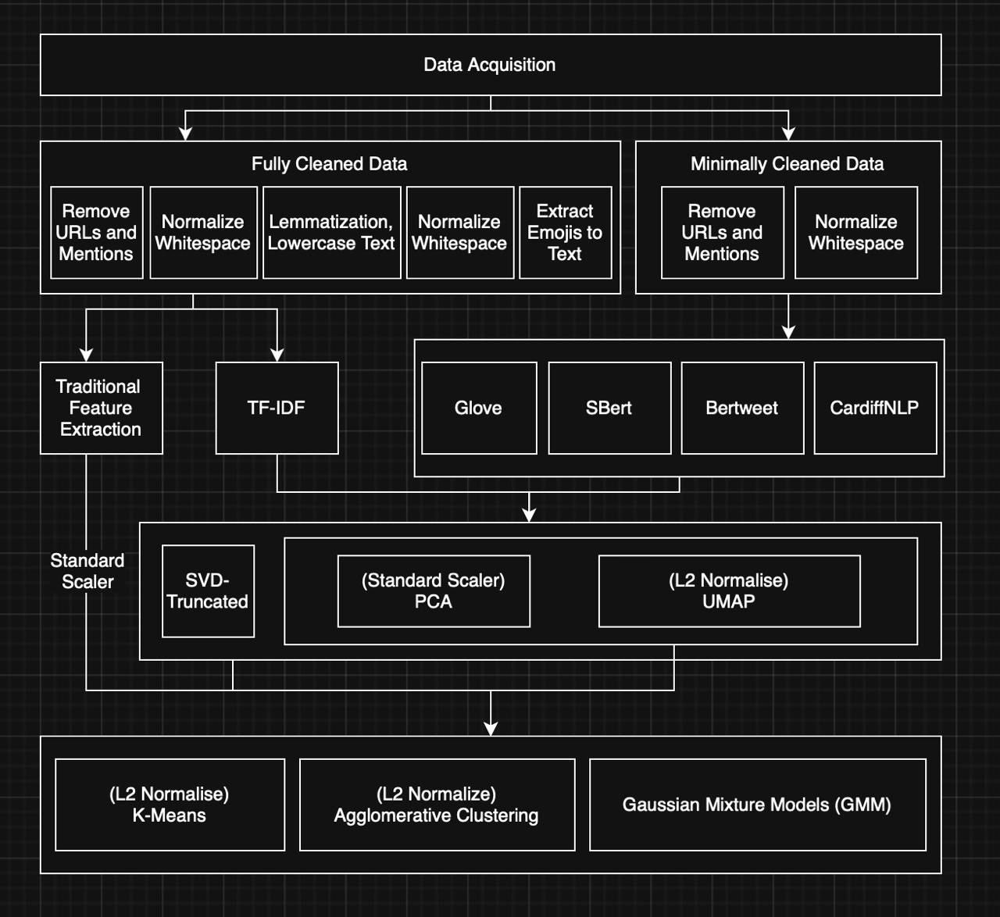

# Airline Twitter Sentiment Clustering

This project explores **unsupervised sentiment clustering** on airline passengers’ tweets about their flight experiences.  
The goal is to discover how well different text representation and clustering techniques can automatically group tweets into sentiment categories such as **positive**, **neutral**, and **negative**.


## Overview

This project applies various **language models** and **clustering algorithms** to perform sentiment grouping on social media data.



### Objectives

- Clean and preprocess raw Twitter text data  
- Transform tweets into feature vectors using various representation methods:
  - **Traditional feature extraction** – handcrafted statistical features such as word count, average word length, punctuation frequency, uppercase ratio, and emoji usage.  
    *(No dimensionality reduction applied.)*
  - **TF-IDF** – converts text into sparse vector representations of term importance.  
    - **Dimensionality reduction:** *Truncated SVD*, *PCA*, or *UMAP*
  - **GloVe** – pre-trained Twitter word embeddings averaged at sentence level.  
    - **Dimensionality reduction:** *PCA* or *UMAP*
  - **SBERT** – Sentence-BERT sentence embeddings representing semantic meaning.  
    - **Dimensionality reduction:** *PCA* or *UMAP*
  - **BERTweet** – transformer-based embeddings trained on 850M English tweets.  
    - **Dimensionality reduction:** *PCA* or *UMAP*
  - **CardiffNLP RoBERTa Sentiment** – domain-specific RoBERTa model fine-tuned for Twitter sentiment.  
    - **Dimensionality reduction:** *PCA* or *UMAP*
- Apply and compare clustering algorithms:
  - **K-Means**
  - **Gaussian Mixture Models (GMM)**
  - **Agglomerative Clustering**


## Evaluation Metrics

Clustering performance was evaluated using:

- **Silhouette Score** – used for selecting optimal clustering parameters  
- **Hungarian Accuracy** – used for final performance evaluation  
- *(Additional metrics such as ARI and NMI were computed for reference but not used for parameter tuning.)*


## Hyperparameter Tuning

Hyperparameter optimization was conducted for the main dimensionality reduction and clustering methods to identify the best-performing combinations.  

- **Dimensionality Reduction:**  
  - *Truncated SVD* – number of components  
  - *PCA* – number of components (selected based on explained variance ratio)  
  - *UMAP* – number of neighbors (`n_neighbors`), minimum distance (`min_dist`), and embedding dimensions (`n_components`)

- **Clustering Algorithms:**  
  - *Gaussian Mixture Model (GMM)* – covariance type 
  - *Agglomerative Clustering* – linkage method 

Silhouette Score was used to select the optimal parameters, while Hungarian Accuracy was used to evaluate the final clustering results.


## Repository Structure

```

Clustering-Sentiment-Analysis/
├── data_cleaning.ipynb             # Preprocess tweets 
├── sample_data_cleaning.ipynb      # Cleaning on sample subset
├── trad_feature_extraction.ipynb   # Traditional feature extraction (no dimensionality reduction)
├── tfidf.ipynb                     # TF-IDF + SVD/PCA/UMAP + clustering
├── glove.ipynb                     # GloVe embeddings + PCA/UMAP + clustering
├── sbert.ipynb                     # SBERT embeddings + PCA/UMAP + clustering
├── bertweet.ipynb                  # BERTweet embeddings + PCA/UMAP + clustering
├── cardiffnlp_twitter_roberta_sentiment.ipynb  # CardiffNLP RoBERTa embeddings + PCA/UMAP + clustering
├── eda.ipynb                       # Exploratory data analysis and visualization
├── requirements.txt                # Python dependencies
├── .gitignore                      # Ignore venv, large files, and data
└── README.md                       # Project documentation

```


## Setup Instructions

### 1. Clone the repository

Run the following commands in your terminal:

```bash
git clone https://github.com/priscillaashleyw/Clustering-Sentiment-Analysis.git
cd Clustering-Sentiment-Analysis
```

### 2. Create and activate a virtual environment

For Mac/Linux:
```bash
python3 -m venv venv
source venv/bin/activate
```

For Windows (Command Prompt or PowerShell):
```bash
python -m venv venv
venv\Scripts\activate
```

### 3. Install dependencies

```bash
pip install -r requirements.txt
```

### 4. Download pretrained embeddings

For GloVe, place `glove.twitter.27B.200d.txt` in the project root directory  

### 5. Launch Jupyter Notebook
```bash
jupyter notebook
```

Then open the desired `.ipynb` file (e.g. `tfidf.ipynb`, `sbert.ipynb`, `glove.ipynb`) and select **Run All Cells** to execute the analysis.


## Notes

- Large files such as `glove.twitter.27B.200d.txt` and the `venv/` folder are excluded via `.gitignore`.
- CSV files contain pre-cleaned or sampled tweet datasets used for testing and tuning.